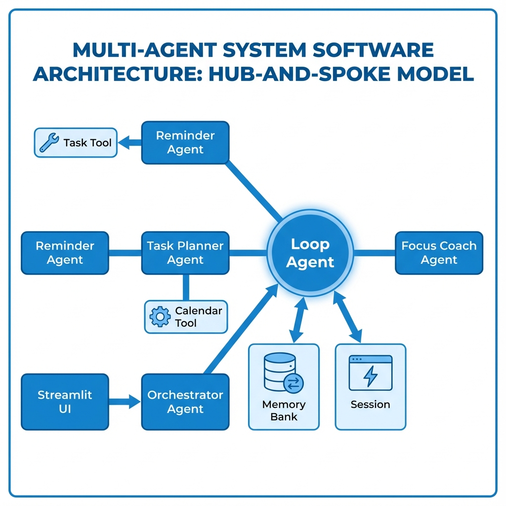

### Problem Statement — What problem I’m solving & why it matters

Every day, people wake up with the same overwhelming question:

“I have so many things to do… but where do I even start?”

Traditional to-do list apps only list tasks. They don’t help you understand:

When to work on each task

How to fit tasks around classes, work, deep-work blocks, or breaks

How to avoid overbooking yourself

Which tasks match your energy level at different times

What’s actually realistic based on deadlines and constraints

This leads to decision fatigue, procrastination, and wasted hours — especially for students and professionals with unpredictable schedules.

The world doesn’t need another to-do list.
It needs an intelligent system that acts like your personal Chief Operating Officer (COO) — someone who understands your routine, your energy, your commitments, and your goals.

My project solves this by building a Daily Productivity OS, a multi-agent workflow that takes messy, human “brain dumps” and turns them into a personalized, realistic, optimized daily plan—fully automated.

### Why Agents? — Why this problem requires an agentic solution

A single LLM prompt cannot reliably handle all parts of the planning process:

Extracting tasks

Understanding durations/deadlines

Resolving conflicts with events

Creating an optimized timeline

Generating motivation + coaching

Using long-term preferences to personalize plans

Each of these requires a specialized capability.

A multi-agent system enables:

✨ Specialized expertise

Reminder Agent → Extracts structured tasks

Task Planner Agent → Applies constraints + builds the schedule

Focus Coach Agent → Provides behavioral advice

Orchestrator + LoopAgent → Coordinates everything

✨ Modularity & Debuggability

Each agent has one responsibility → easier to test, extend, and improve.

✨ Scalability

Future additions (sleep tracking, energy modeling, calendar sync) can be built as new agents.

This approach mirrors how real organizations work:
specialists collaborating toward a goal.

### What I Created — The architecture overview

My system uses a Hub-and-Spoke Multi-Agent Architecture, with the LoopAgent orchestrating all agent calls.

🔵 Architecture Diagram

Core Components
1. Orchestrator Agent (Entry Point)

Receives raw user input and initiates the pipeline.

2. Reminder Agent — The Task Extractor

Parses natural language brain dumps

Extracts tasks into structured JSON

Ensures durations, priorities, and deadlines are included

3. Task Planner Agent — The Strategist

Combines all context:

Extracted tasks

User preferences

MemoryBank information

Calendar constraints

Deep work blocks (e.g., 90 minutes)

It performs constraint-based scheduling to generate a realistic plan.

4. Focus Coach Agent — The Advisor

Reads the final plan and provides:

Motivation

Focus strategies

Task sequencing coaching

Advice to stay consistent

5. Two-Layer Memory System

Long-Term MemoryBank → Deep work preferences, focus hours, sleep schedule

Session Memory → Extracted tasks, generated schedule

This ensures the planner becomes more personalized over time.

6. Observability System (Tracing Engine)

A custom tracing setup logs:

Agent inputs

Agent outputs

Tool call results

Execution time

Intermediate reasoning

This creates a glass-box agent system, making debugging easy and building user trust.

### Demo — How it works (example from actual run)

A user can type something natural like:

“I have college from 9 to 4.
Before that I want to finish my Java assignment (45 mins).
I need to revise DSA, call my mom before 8 PM, and record my capstone video.”

The system automatically:

Extracts clean tasks

Builds a conflict-free daily schedule

Respects Deep Work preferences (e.g., 90-minute blocks)

Avoids overlaps with existing events

Provides Focus Coach guidance

Example schedule (from your UI):

07:30 – 08:15 → Finish Java assignment (45 mins)
08:15 – 08:30 → Get ready for college

09:00 – 16:00 → College (fixed event)

16:30 – 17:30 → Revise DSA (1 hour)
17:30 – 18:00 → Break / Snacks

18:00 – 18:45 → Record capstone video

19:30 – 20:00 → Call Mom (deadline before 8 PM)

20:00 onward → Free time / dinner

This turns productivity into a simple loop:
Dump → Plan → Execute.

### The Build — Technologies & design patterns
Tech Stack

Google Gemini 2.0 Flash

Python

Streamlit frontend

Custom Multi-Agent framework

MCP-Native tools (CalendarTool, TaskTool)

JSON-based memory system

Custom tracing engine for observability

Design Patterns Used

Hub-and-Spoke Architecture

MemoryBank for personalization

Decoupled MCP tools

White-box observability

Constraint satisfaction scheduling

### If I Had More Time — Future Improvements

If time allowed, I would add:

🔗 Real Google Calendar & Notion integrations

🎙️ Voice input (“Plan my day” from your phone)

📈 Energy pattern learning over time

🤖 Reinforcement Learning to improve schedule quality

🔔 Notifications + reminders (desktop & mobile)

🧩 Agent marketplace (custom coaches, optimizers)

🌐 Full deployment as a public web app / mobile PWA
